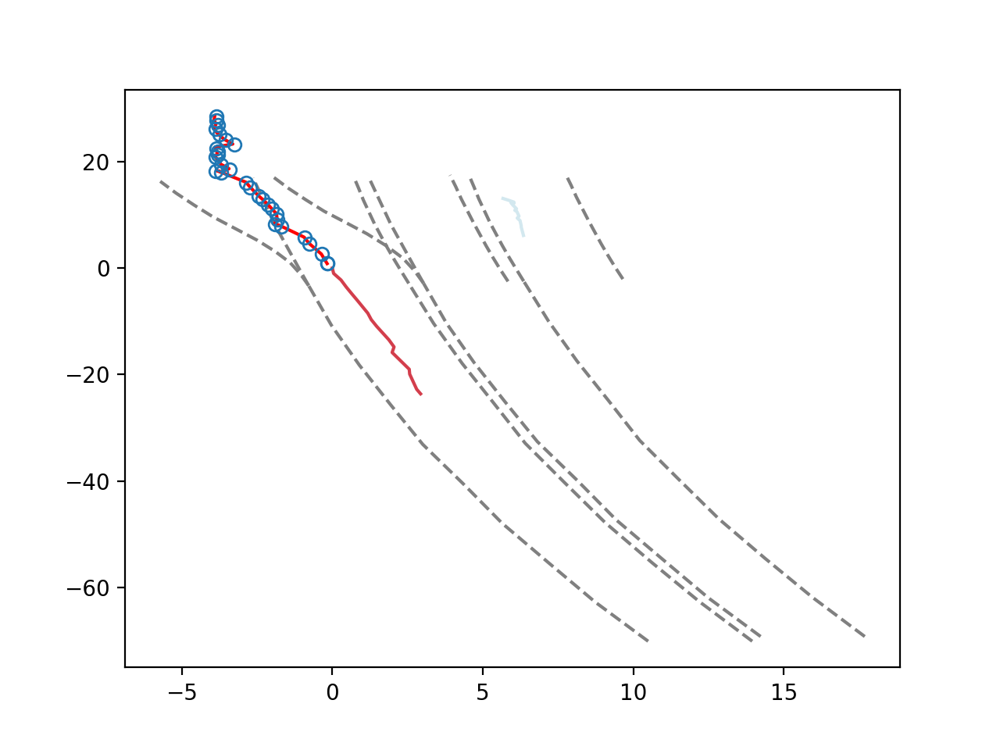
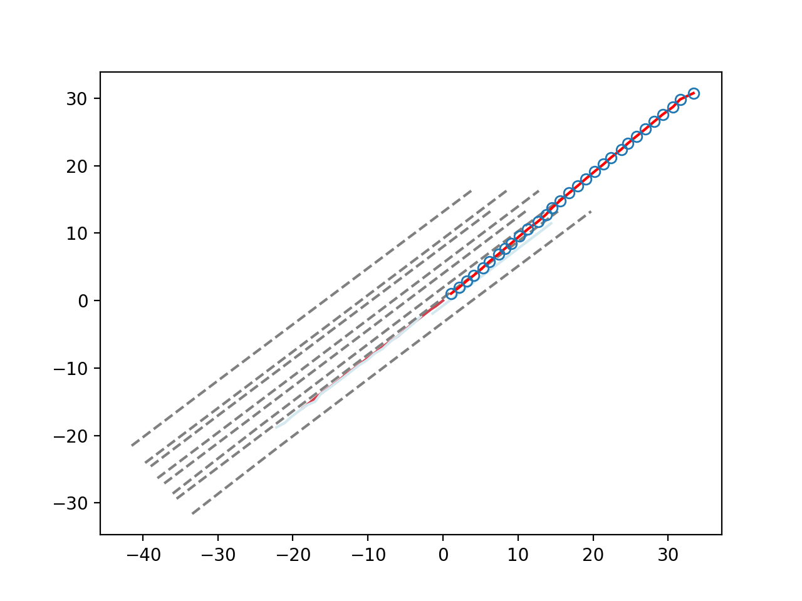
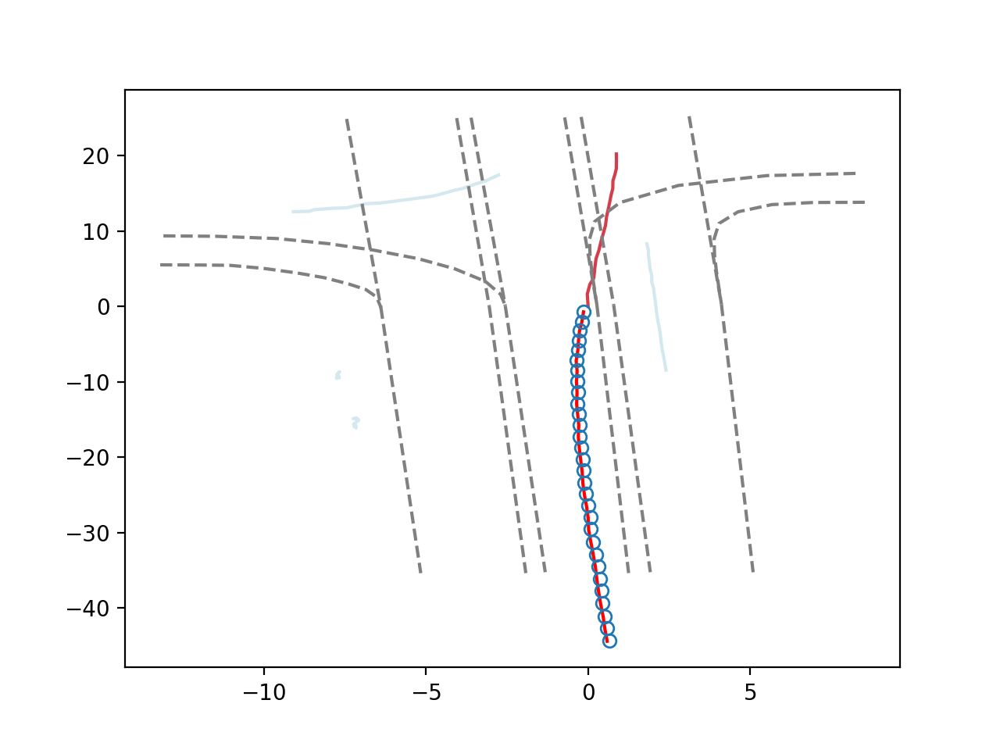
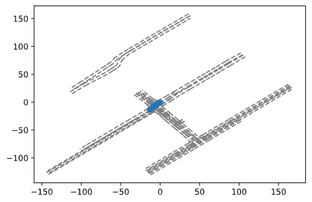
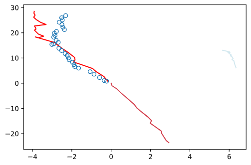
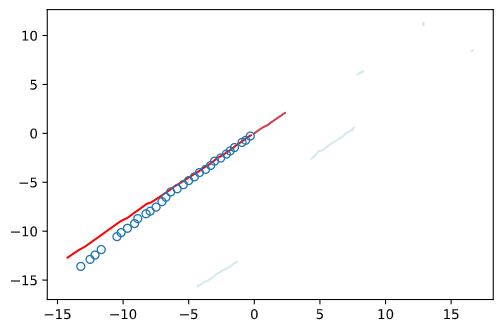

# Reimplement :car:

Still under construction:

- [x] finish the feature preprocessor
- [x] finish the hierarchical GNN
- [x] overfit the tiny sample dataset
- [x] batchify the data and compute subgraph in parallel
- [X] evaluate results on DE / ADE metrics
- [x] refine the feature preprocessor (how to encode the features)
- [x] Check the correctness of hierarchical-GNN's implementation
- [x] run on the whole dataset (running)
- [x] add multi-GPU training (currently too slow, 2h an epoch)
- [ ] add uni-test for each modules
- [ ] More advanced trajectory predictor, generate diverse trajectories (MultiPath, or variational RNNs; current using MLP)

branch `master` is sync with branch `large-scale`; branch `overfit-small` is archived

---

## Table of Contents

- [Environment](#Environment)
- [Usage](#Usage)
- [Results on val and test](#Results-on-val-and-test)
- [Result and visualization for overfitting tiny dataset](#Result-and-visualization-for-overfitting-tiny-dataset)

---

## Environment

Multi-GPU training on Windows Serer 2016, CUDA version 10.1,  2 Titan Xp GPUs.

Install the packages mentioned in requirements.txt
```
pip install -r requirements.txt
```

> torch==1.4.0, 
argoverse-api, 
numpy==1.18.1, 
pandas==1.0.0, 
matplotlib==3.1.1, 
torch-geometric==1.5.0

## Usage

(Remember to run `find . -name "*.DS_Store" -type f -delete` if you're using MacOS)

0) Install [Argoverse-api](https://github.com/argoai/argoverse-api/tree/master/argoverse). Download `HD-maps` in argoverse-api as instructed.

1) download [my prepared dataset objects on Google Drive](https://drive.google.com/file/d/1A8c3PIAaV3OeyHg8lLUg_1AzDky1jEdI/view?usp=sharing) directly and unzip it in path `.`, the go to step 2)

    or prepared the dataset (batchify ...) from raw *.csv. 
   
    put all data (folders named `train/val/test` or a single folder `sample`) in `data` folder.

    An example folder structure:
    ```
    data - train - *.csv
         \        \ ...
          \
           \- val - *.csv
            \       \ ...
             \
              \- test - *.csv
                       \ ...
    ```
2) Modify the config file `utils/config.py`. Use the proper env paths and arguments

    

3) Feature preprocessing, save intermediate data input features (compute_feature_module.py)
    ```
    $ python compute_feature_module.py
    ```
    Use (200, 200) size for a single sequence as the paper told.

4) Train the model (`train.py`; overfit a tiny dataset by setting `small_dataset = True`, and use `GraphDataset` in `dataset.py` to batchify the data)
    ```
    $ python train.py
    ```

---

## Results on val and test

### Result on val

### Result on test

---

## Result and visualization for overfitting tiny dataset

Sample results are shown below:
* red lines are agent input and ground truth output
* blue points are predicted feature tarjectory
* light blue lanes are other moving objects
* grey lines are lanes

### Using nearby context (about 5M around):
| | |
|:-------------------------:|:-------------------------:|
|  |  |
|  |  |

### Using 200 * 200 context (about 100M around):
with lanes:
| | |
|:-------------------------:|:-------------------------:|
|  |  |
|  |  |
|  |  |

without lanes:
| | |
|:-------------------------:|:-------------------------:|
|  |  |
|  |  |
|  |  |
