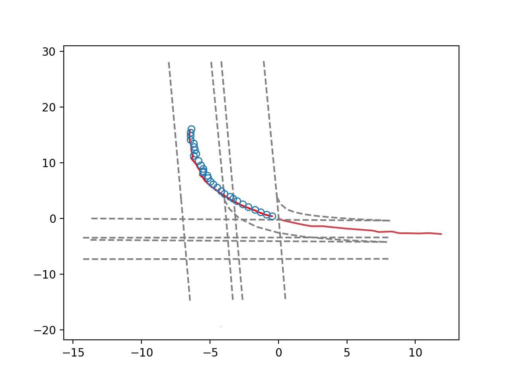
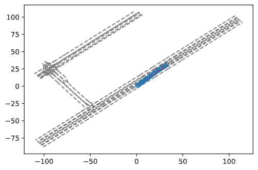
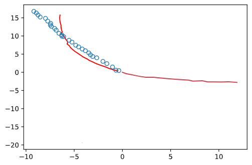
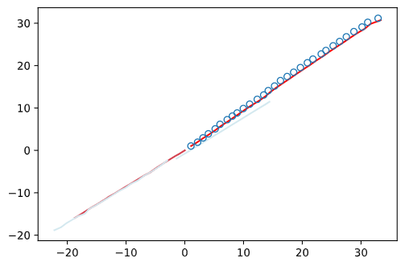

# Reimplement :car:

Still under construction:

- [x] finish the feature preprocessor
- [x] finish the hierarchical GNN
- [x] overfit the tiny sample dataset
- [x] batchify the data and compute subgraph in parallel
- [ ] evaluate results on DE / ADE metrics
- [ ] add uni-test for each modules
- [x] refine the feature preprocessor (how to encode the features)
- [x] Check the correctness of hierarchical-GNN's implementation
- [ ] More advanced trajectory predictor, generate diverse trajectories (MultiPath, or variational RNNs; current using MLP)
- [ ] run on the whole dataset

## Environment
Install the packages mentioned in requirements.txt
```
pip install -r requirements.txt
```

> torch==1.4.0, 
> argoverse-api, 
> numpy==1.18.1, 
> pandas==1.0.0, 
> matplotlib==3.1.1, 
> torch-geometric==1.5.0

## Usage

(Remember to run `find . -name "*.DS_Store" -type f -delete` if you're using MacOS)

0) Install [Argoverse-api](https://github.com/argoai/argoverse-api/tree/master/argoverse). Download `HD-maps` in argoverse-api as instructed.

1) put all data (folders named `train/val/test` or a single folder `sample`) in `data` folder.

    An example folder structure:
    ```
    data - train - *.csv
         \        \ ...
          \
           \- val - *.csv
            \       \ ...
             \
              \- test - *.csv
                       \ ...
    ```
2) Modify the config file `utils/config.py`. Use the proper env paths.

3) Feature preprocessing, save intermediate data input features (compute_feature_module.py)
```
$ python compute_feature_module.py
```
Use (200, 200) size for a single sequence as the paper told.

4) Train the model (`train.py`; overfit a tiny dataset, and use `GraphDataset` in `dataset.py` to batchify the data)
```
$ python train.py
```

## Result and visualization for overfitting tiny dataset

Sample results are shown below:
* red lines are agent input and ground truth output
* blue points are predicted feature tarjectory
* light blue lanes are other moving objects
* grey lines are lanes

### Using nearby context (about 5M around):
| | |
|:-------------------------:|:-------------------------:|
|  |  |
|  |  |

### Using 200 * 200 context (about 100M around):
with lanes:
| | |
|:-------------------------:|:-------------------------:|
|  |  |
|  |  |
|  |  |

without lanes:
| | |
|:-------------------------:|:-------------------------:|
|  |  |
|  |  |
|  |  |
